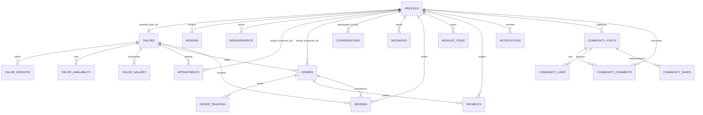

# Database Architecture & Migrations

Sui Dhaga uses **Supabase PostgreSQL** as its primary relational database infrastructure.

---

## 1. Architectural Overview

The database is designed with a fully normalized, relational schema featuring:
- **Strong Referential Integrity**: Foreign keys with cascading deletes or set-null constraints.
- **Strict Data Types**: Enums for roles, statuses, payment providers, and units.
- **Row Level Security (RLS)**: Enforced at the PostgreSQL level for tenant data isolation.
- **Automated Lifecycle Triggers**: Automatic `updated_at` timestamps on records and auto-sync of `auth.users` to `public.profiles`.
- **Indexed Lookups**: High-performance B-tree indexes on foreign keys, composite user-lookup filters, and status flags.

---

## 2. Entity-Relationship Overview

---

## 3. Database Tables Summary

| Table Name | Description | Key Columns / Relations |
| :--- | :--- | :--- |
| `profiles` | User profiles extending Supabase auth | `id` (PK -> auth.users), `role`, `status`, `full_name`, `avatar_url` |
| `tailors` | Tailor artisan business profiles | `id`, `user_id` (FK -> profiles), `shop_name`, `specialties`, `rating`, `verification_status` |
| `tailor_services` | Tailor service catalog & prices | `id`, `tailor_id` (FK -> tailors), `title`, `price`, `category`, `is_active` |
| `tailor_availability` | Weekly availability time slots | `id`, `tailor_id` (FK -> tailors), `day_of_week`, `start_time`, `end_time` |
| `tailor_gallery` | Portfolio & showroom gallery images | `id`, `tailor_id` (FK -> tailors), `image_url`, `caption`, `display_order` |
| `measurements` | Customer custom body measurements | `id`, `user_id` (FK -> profiles), `unit`, `chest`, `waist`, `hips`, `shoulder`, etc. |
| `designs` | AI generated & custom studio designs | `id`, `user_id` (FK -> profiles), `prompt`, `image_url`, `colors`, `fabric`, `pdf_url` |
| `fabrics` | Fabric catalog & pricing | `id`, `name`, `material`, `price_per_meter`, `color`, `in_stock` |
| `appointments` | Tailor booking appointments | `id`, `customer_id` (FK), `tailor_id` (FK), `service_id` (FK), `status`, `appointment_date` |
| `orders` | Custom tailoring orders | `id`, `customer_id` (FK), `tailor_id` (FK), `design_id` (FK), `measurement_id` (FK), `total_amount`, `status` |
| `order_tracking` | Real-time order progress timeline | `id`, `order_id` (FK -> orders), `status`, `description`, `location` |
| `conversations` | 1-on-1 direct chat threads | `id`, `participant1_id` (FK), `participant2_id` (FK), `last_message`, `last_message_at` |
| `messages` | Chat messages & attachments | `id`, `conversation_id` (FK), `sender_id` (FK), `text`, `attachments`, `is_read` |
| `reviews` | Tailor & order ratings & reviews | `id`, `order_id` (FK), `tailor_id` (FK), `customer_id` (FK), `rating`, `comment` |
| `wishlist_items` | Customer saved designs & tailors | `id`, `user_id` (FK), `item_type`, `tailor_id` (FK), `design_id` (FK) |
| `payments` | Checkout sessions & transactions | `id`, `order_id` (FK), `user_id` (FK), `amount`, `provider`, `status`, `transaction_id` |
| `notifications` | User notifications & alerts | `id`, `user_id` (FK), `title`, `message`, `type`, `is_read`, `data` |
| `community_posts` | Feed posts & style showcases | `id`, `user_id` (FK), `title`, `content`, `images`, `tags`, `likes_count` |
| `community_comments` | Comments on community posts | `id`, `post_id` (FK), `user_id` (FK), `content` |
| `community_likes` | Post likes junction | `(post_id, user_id)` PK |
| `community_saves` | Post bookmarks junction | `(post_id, user_id)` PK |
| `reports` | Moderation & user reports | `id`, `reporter_id` (FK), `target_type`, `target_id`, `reason`, `status` |

---

## 4. SQL Migrations & Development

- All schema definitions are stored in [`supabase/migrations/001_initial_schema.sql`](file:///e:/codingfolder/Sui%20Dhaga/backend/supabase/migrations/001_initial_schema.sql).
- Row Level Security policies are maintained in [`supabase/policies/rls-policies.sql`](file:///e:/codingfolder/Sui%20Dhaga/backend/supabase/policies/rls-policies.sql).
- Seed data for development is located in [`supabase/seed/seed.sql`](file:///e:/codingfolder/Sui%20Dhaga/backend/supabase/seed/seed.sql).
- Storage buckets configuration is located in [`supabase/storage/buckets.sql`](file:///e:/codingfolder/Sui%20Dhaga/backend/supabase/storage/buckets.sql).

> [!NOTE]
> Do NOT use ORMs like Prisma or Sequelize. All database access uses the native typed Supabase client against standard relational PostgreSQL tables.

